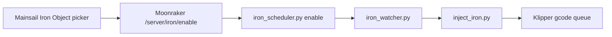

# Mid-Print Per-Object Iron Scheduler — Installation Guide

Schedule ironing on **remaining top layers** for **one object** mid-print, using the same labeled-object list as Mainsail **Exclude Objects**. Pick the object on a **bed-map** (not a text list).

Tested on: Klipper + Moonraker + Mainsail, OrcaSlicer with **Label objects** enabled.

---

## What it does

1. **Index** the active gcode file (objects, top layers, iron geometry) into `iron_cache/`.
2. **Schedule** when you pick an object + mode (`topmost` or `all_top`) while printing or paused.
3. **Inject** cached iron moves at the right layers via `iron_watcher.py` → `inject_iron.py` → Moonraker `gcode/script`.

Iron runs **during** the print at scheduled layers — not immediately when you click the button.

**Does not modify** `PRINT_START`, `PRINT_END`, or slicer gcode.

---

## Requirements

| Requirement | Notes |
|-------------|--------|
| Klipper | `[exclude_object]` enabled in `printer.cfg` |
| Moonraker | `[file_manager] enable_object_processing: True` recommended |
| Mainsail | v2.9+; status panel toolbar |
| OrcaSlicer (or compatible) | **Label objects** on (same as Exclude Objects) |
| Python 3 | On the host running Moonraker/Klipper |
| `gcode_shell_command` | Klipper extension (standard on most installs) |
| `[respond]` | Needed for macro prompt fallbacks |

Objects must have **ironable top-layer geometry** in the cache (solid top surfaces). Small spacers / parts without top-surface iron moves will return *"No ironable top layers"*.

---

## Quick install (recommended)

Copy the `printer_data` iron bundle to the printer (this folder), then:

```bash
cd ~/printer_data
chmod +x install-iron-scheduler.sh scripts/*.py
./install-iron-scheduler.sh
```

Restart services when **not printing**:

```bash
# Klipper — picks up iron_scheduler.cfg + [respond]
FIRMWARE_RESTART

# Moonraker — loads iron_enable API component
sudo systemctl restart moonraker
```

Open Mainsail, start a multi-object print, click **Iron Object** in the status panel.

---

## What the install script does

`install-iron-scheduler.sh` copies:

| Source | Destination |
|--------|-------------|
| `scripts/iron_scheduler.py` | `~/printer_data/scripts/` |
| `scripts/inject_iron.py` | `~/printer_data/scripts/` |
| `scripts/iron_watcher.py` | `~/printer_data/scripts/` |
| `scripts/patch-mainsail-iron-button.py` | `~/printer_data/scripts/` |
| `scripts/iron_api_server.py` | `~/printer_data/scripts/` (legacy, optional) |
| `config/iron_scheduler.cfg` | `~/printer_data/config/` |
| `iron-picker/*` | `~/mainsail/iron-picker/` |
| `scripts/iron_enable_moonraker_component.py` | `~/moonraker/moonraker/components/iron_enable.py` |

It also:

- Appends `[include iron_scheduler.cfg]` and `[respond]` to `config/printer.cfg` (if missing)
- Appends `[iron_enable]` to `config/moonraker.conf` (if missing)
- Patches the Mainsail JS bundle to add the **Iron Object** toolbar button
- Creates `iron_cache/` with correct ownership expectations

---

## Manual install (step by step)

Use this if you prefer full control or the script fails on your paths.

### 1. Klipper — `printer.cfg`

Add after your other includes (e.g. after `KAMP_Settings.cfg`):

```ini
[include iron_scheduler.cfg]

[respond]
```

**Do not** edit `PRINT_START` or `PRINT_END` for iron.

Restart Klipper when idle: `FIRMWARE_RESTART`

### 2. Klipper — `config/iron_scheduler.cfg`

Shipped in this repo. Defines:

- `[gcode_shell_command iron_index]` / `iron_enable`
- Macros: `IRON_MENU`, `IRON_MODE_MENU`, `IRON_ENABLE`

**Important:** `gcode_shell_command` paths are **absolute**. If your printer data is not `/home/x/printer_data`, edit these lines:

```ini
command: python3 /home/x/printer_data/scripts/iron_scheduler.py index --file
command: python3 /home/x/printer_data/scripts/iron_scheduler.py enable --file
```

`RUN_SHELL_COMMAND` params must be quoted (already correct in shipped cfg):

```ini
RUN_SHELL_COMMAND CMD=iron_enable PARAMS="{enable_args}"
```

### 3. Python scripts

```bash
mkdir -p ~/printer_data/scripts ~/printer_data/iron_cache
cp scripts/{iron_scheduler,inject_iron,iron_watcher,patch-mainsail-iron-button}.py ~/printer_data/scripts/
chmod +x ~/printer_data/scripts/*.py
```

Scripts honor `PRINTER_DATA` and `MOONRAKER_URL` environment variables (defaults: `/home/x/printer_data`, `http://127.0.0.1:7125`).

### 4. Moonraker — API component

```bash
cp scripts/iron_enable_moonraker_component.py \
   ~/moonraker/moonraker/components/iron_enable.py
```

Add to `config/moonraker.conf`:

```ini
[iron_enable]
```

Restart Moonraker. Verify in `moonraker.log`:

```
Iron enable API loaded at /server/iron/enable
```

Health check:

```bash
curl -s http://127.0.0.1:7125/server/iron/health
# {"result":{"ok":true}}
```

The bed-map picker uses **`POST /server/iron/enable`** (fast path, does not queue behind the SD print like `printer.gcode.script`).

### 5. Mainsail — bed-map picker + toolbar button

**Static UI files:**

```bash
mkdir -p ~/mainsail/iron-picker
cp iron-picker/* ~/mainsail/iron-picker/
```

**Load scripts in Mainsail** — add to `~/mainsail/index.html` inside `<head>` / before `</body>`:

```html
<link rel="stylesheet" href="/iron-picker/iron-picker.css" />
<link rel="stylesheet" href="/iron-picker/iron-picker-embed.css" />
<script src="/iron-picker/iron-picker-core.js?v=3"></script>
<script src="/iron-picker/iron-picker-embed.js?v=3"></script>
```

Bump `?v=` after picker updates to bust browser cache.

**Patch Mainsail bundle** (adds **Iron Object** next to Exclude Objects):

```bash
python3 ~/printer_data/scripts/patch-mainsail-iron-button.py
```

Creates a backup: `assets/index-*.js.bak-iron`

Re-run the patch after **Mainsail updates** (new `index-*.js` bundle).

### 6. Optional — legacy HTTP API + nginx

The current picker uses Moonraker `/server/iron/enable`. An older sidecar still exists:

- `scripts/iron_api_server.py` on `127.0.0.1:8765`
- `systemd/iron-api.service`
- nginx `location /iron-api/` → proxy to 8765

**Not required** for the shipped Mainsail embed. Skip unless you need the standalone `/iron-picker/` page without Moonraker routes.

---

## Path customization checklist

If your home directory is not `/home/x`, update:

| File | What to change |
|------|----------------|
| `config/iron_scheduler.cfg` | Both `gcode_shell_command` `command:` paths |
| `install-iron-scheduler.sh` | `MOONRAKER_COMP=` line (~line 33) |
| `scripts/patch-mainsail-iron-button.py` | `MAINSAIL_ASSETS` path |
| `systemd/iron-api.service` | `User`, `PRINTER_DATA`, `ExecStart` paths |

Python scripts use `PRINTER_DATA` env var — set in systemd or shell if needed.

---

## Usage

While **printing** or **paused**:

1. Click **Iron Object** in the Mainsail status panel (or open `http://<printer-ip>/iron-picker/`).
2. Click the object on the 2D bed map (same layout as Exclude Objects).
3. Choose **Top Surface Only** (`topmost`) or **All Top Layers** (`all_top`).
4. Wait for *"Iron scheduled for … at layer(s) …"* — injection happens when those layers are reached.

**Tips:**

- Schedule iron **after** homing/mesh/purge finish (not during `PRINT_START`).
- Only objects with top-surface iron geometry in the cache will succeed.
- Mainsail ETA does not include iron time (known limitation).

### Macro fallback (console)

- `IRON_MENU` — points you to the bed-map picker
- `IRON_MODE_MENU OBJECT="name"` — text mode picker
- `IRON_ENABLE OBJECT="name" MODE=topmost` — schedule via Klipper macro (queues behind SD print; prefer UI API)

---

## Verify installation

```bash
# Config includes
grep iron_scheduler ~/printer_data/config/printer.cfg
grep '^\[respond\]' ~/printer_data/config/printer.cfg
grep '^\[iron_enable\]' ~/printer_data/config/moonraker.conf

# Files
ls -la ~/printer_data/scripts/iron_*.py ~/printer_data/scripts/inject_iron.py
ls -la ~/printer_data/config/iron_scheduler.cfg
ls -la ~/mainsail/iron-picker/

# Moonraker API
curl -s http://127.0.0.1:7125/server/iron/health

# Manual index test (replace filename)
python3 ~/printer_data/scripts/iron_scheduler.py index --file "YourPrint.gcode"
ls ~/printer_data/iron_cache/
```

During a labeled-object print, `iron_cache/<filename>.json` should appear after the first index/enable.

---

## Architecture



| File | Role |
|------|------|
| `scripts/iron_scheduler.py` | Index gcode, build cache, schedule layers, spawn watcher |
| `scripts/iron_watcher.py` | Poll print layer; trigger injection |
| `scripts/inject_iron.py` | Stream iron gcode via Moonraker `gcode/script` |
| `moonraker/components/iron_enable.py` | HTTP API for fast enable from UI |
| `config/iron_scheduler.cfg` | Klipper shell commands + macros |
| `iron-picker/` | Bed-map UI (embedded in Mainsail) |
| `iron_cache/*.json` | Per-file object/layer iron geometry (auto) |
| `iron_cache/*.schedule.json` | Active schedule for current print (auto) |

---

## Troubleshooting

| Symptom | Likely cause | Fix |
|---------|--------------|-----|
| No **Iron Object** button | Mainsail bundle not patched or updated | Re-run `patch-mainsail-iron-button.py` |
| "No objects found" | Label objects off in slicer | Enable in OrcaSlicer; re-slice |
| "Object not found" | Case mismatch | Fixed in scheduler (case-insensitive); restart if old script |
| "Scheduling iron…" forever | UI used `gcode/script` instead of API | Use shipped picker (`/server/iron/enable`) |
| Malformed `RUN_SHELL_COMMAND` | Missing quotes on `PARAMS` | Use shipped `iron_scheduler.cfg` |
| Permission denied on `iron_cache/` | Wrong file owner | `chown <user>:<user> ~/printer_data/iron_cache` |
| "No ironable top layers" | Object has no top-surface iron in gcode | Expected for small parts; pick housing/large tops |
| Iron at end broke park | Injection + `SAVE_CONFIG` restart race | Schedule iron mid-print; avoid end layers; see notes below |

### End-of-print / start-of-print notes

- **Does not change** `PRINT_START` / `PRINT_END`.
- Pre-print Z motion (lift/drop several times) is normal: `G32` → `QUAD_GANTRY_LEVEL` (often 3–4 retry rounds) → tap → mesh.
- If the nozzle stays on the print at job end, check whether `SAVE_CONFIG` restarted Klipper (Eddy drift) while iron injection was still in the queue — test **without iron** first to isolate.

---

## Uninstall

1. Remove `[include iron_scheduler.cfg]` and `[iron_enable]` from configs.
2. Remove `~/moonraker/moonraker/components/iron_enable.py`.
3. Restore Mainsail bundle from `assets/index-*.js.bak-iron` if desired.
4. Remove iron-picker script/link tags from `mainsail/index.html`.
5. `FIRMWARE_RESTART` + restart Moonraker.

---

## Files in this package

```
printer_data/
├── README-iron-scheduler.md          ← this guide
├── install-iron-scheduler.sh
├── config/
│   └── iron_scheduler.cfg
├── scripts/
│   ├── iron_scheduler.py
│   ├── inject_iron.py
│   ├── iron_watcher.py
│   ├── patch-mainsail-iron-button.py
│   ├── iron_enable_moonraker_component.py
│   └── iron_api_server.py            (optional legacy)
├── iron-picker/
│   ├── iron-picker-core.js
│   ├── iron-picker-embed.js
│   ├── iron-picker-embed.css
│   ├── iron-picker.css
│   └── index.html                    (standalone page)
├── systemd/
│   └── iron-api.service              (optional legacy)
└── iron_cache/                       (created at runtime)
```

---

## License / upstream

Moonraker component header: GNU GPLv3 (same as Moonraker). Contribution-friendly — see `MAINSAIL-ISSUE-iron-object-picker.md` for a Mainsail feature-request draft.