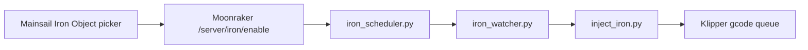

# Klipper Ironing Mid-Print

Schedule **per-object ironing** on remaining top layers **while a print is running** — without editing gcode or touching `PRINT_START` / `PRINT_END`.

Built for **Klipper + Moonraker + Mainsail**, with **OrcaSlicer** (or any slicer that emits labeled objects). Pick the target object on a **bed map** (same layout as Exclude Objects), not from a text list.

---

## How it works

1. **Index** — Parse the active gcode file (objects, top layers, iron geometry) into `iron_cache/`.
2. **Schedule** — When you pick an object and mode (`topmost` or `all_top`) during a print or pause.
3. **Inject** — At the scheduled layers, `iron_watcher.py` → `inject_iron.py` → Moonraker `gcode/script` streams cached iron moves mid-print.

Iron runs **at the scheduled layers**, not when you click the button. Injection does **not** modify the gcode file on disk.



---

## Requirements

| Requirement | Notes |
|-------------|--------|
| Klipper | `[exclude_object]` enabled in `printer.cfg` |
| Moonraker | `[file_manager] enable_object_processing: True` recommended |
| Mainsail | v2.9+; status panel toolbar |
| OrcaSlicer (or compatible) | **Label objects** enabled |
| Python 3 | On the host running Moonraker |
| `gcode_shell_command` | Standard Klipper extension |
| `[respond]` | Macro prompt fallbacks |

Objects need **ironable top-layer geometry** in the cache. Small parts without top-surface iron moves return *"No ironable top layers"*.

---

## Quick install

Clone or copy this repo into `~/printer_data`, then:

```bash
cd ~/printer_data
chmod +x install-iron-scheduler.sh scripts/*.py
./install-iron-scheduler.sh
```

Restart when **not printing**:

```bash
FIRMWARE_RESTART                    # Klipper — loads iron_scheduler.cfg
sudo systemctl restart moonraker    # Moonraker — loads iron_enable API
```

Open Mainsail, start a multi-object print, click **Iron Object** in the status panel.

### What the install script does

| Source | Destination |
|--------|-------------|
| `scripts/iron_scheduler.py` | `~/printer_data/scripts/` |
| `scripts/inject_iron.py` | `~/printer_data/scripts/` |
| `scripts/iron_watcher.py` | `~/printer_data/scripts/` |
| `scripts/patch-mainsail-iron-button.py` | `~/printer_data/scripts/` |
| `config/iron_scheduler.cfg` | `~/printer_data/config/` |
| `iron-picker/*` | `~/mainsail/iron-picker/` |
| `scripts/iron_enable_moonraker_component.py` | `~/moonraker/moonraker/components/iron_enable.py` |

Also appends `[include iron_scheduler.cfg]`, `[respond]`, and `[iron_enable]` if missing, patches the Mainsail bundle for the toolbar button, and creates `iron_cache/`.

---

## Usage

While **printing** or **paused**:

1. Click **Iron Object** in the Mainsail status panel (or open `http://<printer-ip>/iron-picker/`).
2. Click the object on the 2D bed map.
3. Choose **Top Surface Only** (`topmost`) or **All Top Layers** (`all_top`).
4. Wait for *"Iron scheduled for … at layer(s) …"* — injection happens when those layers are reached.

**Tips**

- Schedule iron **after** homing/mesh/purge finish.
- Only objects with cached top-surface iron geometry will succeed.
- Mainsail ETA does not include iron time.

### Macro fallback (console)

- `IRON_MENU` — points to the bed-map picker
- `IRON_MODE_MENU OBJECT="name"` — text mode picker
- `IRON_ENABLE OBJECT="name" MODE=topmost` — via Klipper macro (queues behind SD print; prefer the UI API)

---

## Verify installation

```bash
grep iron_scheduler ~/printer_data/config/printer.cfg
grep '^\[iron_enable\]' ~/printer_data/config/moonraker.conf
curl -s http://127.0.0.1:7125/server/iron/health
# {"result":{"ok":true}}

python3 ~/printer_data/scripts/iron_scheduler.py index --file "YourPrint.gcode"
ls ~/printer_data/iron_cache/
```

---

## Path customization

If your home directory is not `/home/x`, update:

| File | What to change |
|------|----------------|
| `config/iron_scheduler.cfg` | Both `gcode_shell_command` `command:` paths |
| `install-iron-scheduler.sh` | `MOONRAKER_COMP=` line |
| `scripts/patch-mainsail-iron-button.py` | `MAINSAIL_ASSETS` path |

Scripts honor `PRINTER_DATA` (default `/home/x/printer_data`) and `MOONRAKER_URL` (default `http://127.0.0.1:7125`).

---

## Architecture

| File | Role |
|------|------|
| `scripts/iron_scheduler.py` | Index gcode, build cache, schedule layers, spawn watcher |
| `scripts/iron_watcher.py` | Poll print layer; trigger injection |
| `scripts/inject_iron.py` | Stream iron gcode via Moonraker `gcode/script` |
| `scripts/iron_enable_moonraker_component.py` | Source for Moonraker `iron_enable.py` API |
| `config/iron_scheduler.cfg` | Klipper shell commands + macros |
| `iron-picker/` | Bed-map UI embedded in Mainsail |
| `iron_cache/*.json` | Per-file object/layer iron geometry (runtime) |
| `iron_cache/*.schedule.json` | Active schedule for current print (runtime) |

### API endpoints

- `POST /server/iron/enable` — schedule iron from UI (fast path)
- `GET /server/iron/schedule?file=…`
- `GET /server/iron/cache?file=…`
- `GET /server/iron/health`

---

## Troubleshooting

| Symptom | Likely cause | Fix |
|---------|--------------|-----|
| No **Iron Object** button | Mainsail bundle not patched | Re-run `patch-mainsail-iron-button.py` after Mainsail updates |
| "No objects found" | Label objects off in slicer | Enable in OrcaSlicer; re-slice |
| "Scheduling iron…" forever | UI used `gcode/script` instead of API | Use shipped picker (`/server/iron/enable`) |
| Permission denied on `iron_cache/` | Wrong file owner | `chown <user>:<user> ~/printer_data/iron_cache` |
| "No ironable top layers" | No top-surface iron in gcode for that object | Expected for small parts; pick objects with solid tops |
| Iron on wrong shape | Template translated from another object | Use Orca native iron on that object, or re-slice with matching geometry |

Re-run `patch-mainsail-iron-button.py` after every **Mainsail update** (new `index-*.js` bundle). Bump `?v=` on iron-picker script tags in `mainsail/index.html` to bust browser cache.

---

## Manual install

See [README-iron-scheduler.md](README-iron-scheduler.md) for step-by-step manual install, nginx legacy API, uninstall, and detailed notes.

---

## Repo layout

```
├── README.md
├── install-iron-scheduler.sh
├── config/iron_scheduler.cfg
├── scripts/
│   ├── iron_scheduler.py
│   ├── inject_iron.py
│   ├── iron_watcher.py
│   ├── patch-mainsail-iron-button.py
│   └── iron_enable_moonraker_component.py
├── iron-picker/
├── systemd/iron-api.service   # optional legacy sidecar
└── iron_cache/                # created at runtime (gitignored)
```

---

## License

Moonraker component source is **GNU GPLv3** (same as Moonraker). See `MAINSAIL-ISSUE-iron-object-picker.md` for a Mainsail feature-request draft.